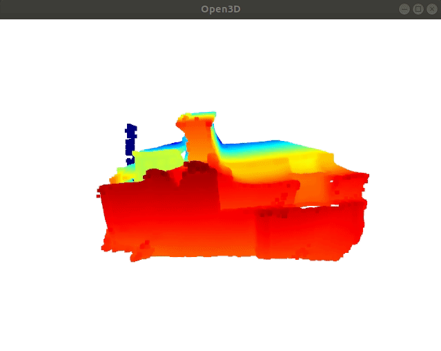

# PCD Animated Viewer

Visualize the point cloud `pcd`, `ply` files in a folder and support simple play with keyboard.



### Run Instruction

Simply call `main.py` with following arguments:

```shell
python main.py --ply_folder=/your/ply/folder \
                --file_type=pcd \
                --keyboard=True \
                --window_width=640 \
                --window_height=480 
```

Then press `Enter` to play the pcd files.

If you want to automatically play the video please use the following command:

```shell
python main.py --ply_folder=/your/ply/folder \
                --file_type=pcd \
                --keyboard=False \
                --pause_time=0.3 \
                --window_width=640 \
                --window_height=480 
```

### Customize View Point

If you want to run with custom view point, please record your own `ScreenCamera` pose by pressing `p` key when you are in an open3d visualization window. The `ScreenCamera_xxxx.json` file will be saved in the current working folder.

Please use the following command to run with customized viewpoint:
```shell
python main.py --ply_folder=/your/ply/folder \
                --file_type=pcd \
                --keyboard=False \
                --pause_time=0.3 \
                --window_width=640 \
                --window_height=480 \
                --camera_view='ScreenCamera_xxxxx.json'
```

Where `ScreenCamera_xxxxx.json` is the json file you saved in the previous step.
